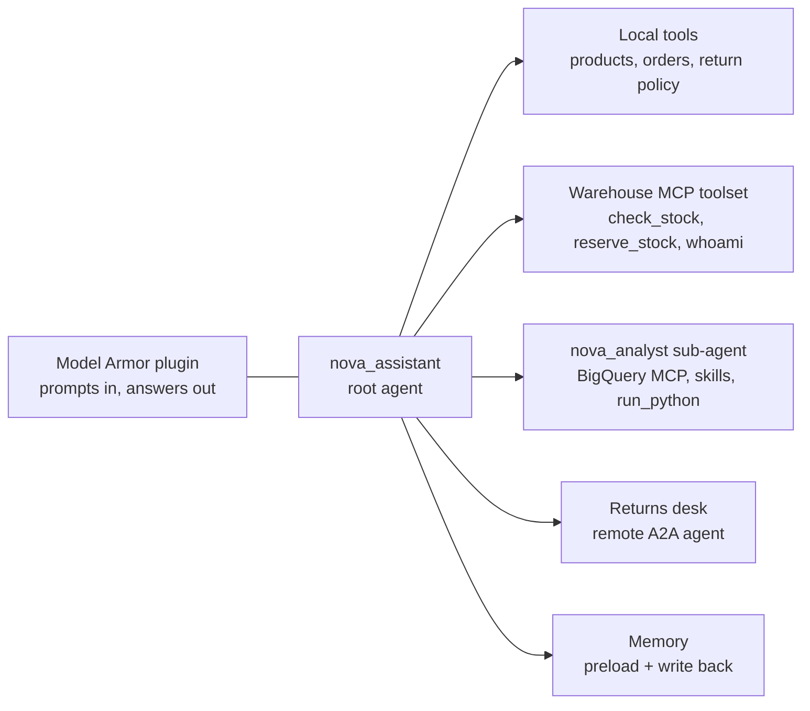
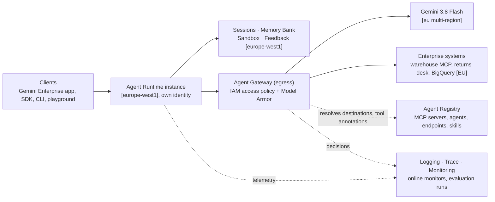

# Building agents on Gemini Enterprise Agent Platform — an e‑commerce workshop for EU teams

A hands-on, notebook-driven workshop that takes one agent from a laptop to a governed,
observable, evaluated production deployment on **Gemini Enterprise Agent Platform (GEAP)**,
with **every workshop resource and every processing step placed in the EU** where the platform
offers an EU location. It is written for teams that must keep customer data and model traffic
inside EU boundaries, and every lab says where its data lives and why.

Everything runs in `europe-west1` with the model served from the `eu` multi-region, using
**Gemini 3.8 Flash**, the **Agent Development Kit (ADK)** and the **Agents CLI**.

## Prerequisites

* A Google account with permission to create a Google Cloud project and link billing.
  Sandbox organizations work fine. You will be **Owner** of the new project. Lab06 also needs
  **Organization Policy Administrator** (or an admin who can run one command for you) when your organisation enforces
  `iam.managed.disableAccessPolicyBinding`.
* A machine (laptop, Cloud Workstation, Cloud Shell editor…) with:
  * Python 3.11+ and [`uv`](https://docs.astral.sh/uv/getting-started/installation/)
  * [Google Cloud CLI](https://cloud.google.com/sdk/docs/install) (`gcloud`), logged in:
    `gcloud auth login` **and** `gcloud auth application-default login`
  * Node.js 18+ (only needed by `agents-cli setup` to install coding-agent skills; optional)
* Optional but recommended: a coding agent (Antigravity, Gemini CLI, Codex, Cursor…) —
  the Agents CLI installs skills that teach it the same workflow you follow in these labs.

## Setup (5 minutes)

```bash
git clone https://github.com/alukin40/geap-workshop-ecommerce-alukin.git && cd geap-workshop-ecommerce-alukin

# Python environment for the notebooks (Jupyter + ADK + GEAP SDKs): creates .venv from uv.lock with every dependency pinned
uv sync
uv run python -c "import google.adk, google.cloud.bigquery, db_dtypes, pandas, agentplatform; print('environment ok')"
uv run python -m ipykernel install --user --name geap-workshop --display-name "Python (geap-workshop)"

# Start JupyterLab and open labs/lab00_setup.ipynb
uv run jupyter lab
```

Use that `.venv` as the notebook kernel (JupyterLab: "Python (geap-workshop)"; VS Code: pick `.venv` in the kernel picker). Do not
create the environment by hand with `pip`: the notebooks rely on the versions in `uv.lock`, and a hand-made environment misses
indirect requirements such as `db-dtypes` for BigQuery result frames.

Run the labs **in order**. Lab00 writes a `workshop.env` file at the repo root that every
other lab reads, so you never retype project IDs. Some cells intentionally take a while
(Agent Runtime deployments run 5–10 minutes).

> **Cost note.** Everything is pay-as-you-go and small: a handful of Gemini calls,
> one Agent Runtime instance (idle time is not billed), two tiny Cloud Run services that scale to zero, a
> BigQuery dataset of 240 rows. Delete the project at the end (Lab09 unlinks billing and shuts it down).

## The storyline: Nova Market

**Nova Market** is a fictional online electronics marketplace selling laptops, phones,
audio, TVs and home appliances across Central Europe. We build the **Nova Assistant**:

| Lab | What Nova Assistant learns | GEAP capability | Run time* |
| --- | --- | --- | --- |
| [Lab00](labs/lab00_setup.ipynb) | – (get a clean project ready) | Project, APIs, Agents CLI, model access on the `eu` endpoint | 2 min |
| [Lab01](labs/lab01_local_agent.ipynb) | Answer product questions, look up orders, explain the return policy | ADK agent, tools, `agents-cli run`, `adk run`, web playground | 1 min |
| [Lab02](labs/lab02_deploy_and_register.ipynb) | Serve real users from the cloud | Agent Runtime, Agent Identity, Agent Registry | 7 min |
| [Lab03](labs/lab03_mcp_and_skills.ipynb) | Answer "how are sales doing?" from real data, check live warehouse stock, and let an analyst sub-agent use domain skills | BigQuery remote MCP server (EU dataset), a custom MCP server on Cloud Run, **Agent Registry** (MCP servers, public and private **Skills**) | 11 min |
| [Lab04](labs/lab04_agent_runtime.ipynb) | Remember shoppers across conversations, do the maths in a sandbox, collect feedback, be debuggable | **Agent Runtime** end to end: Sessions, Memory Bank, Code Execution, Feedback service (Preview), metrics, logs, traces | 11 min |
| [Lab05](labs/lab05_model_armor.ipynb) | Resist prompt injection and never leak personal data | Model Armor (two regional templates, ADK's built-in plugin, floor settings), log-based alerts | 4 min |
| [Lab06](labs/lab06_agent_gateway_identity.ipynb) | Talk to the returns desk (A2A agent) and the warehouse – but only what policy allows, with Model Armor on the network path | Agent Identity, Agent Gateway, IAM access policies, Model Armor at the gateway | 31 min |
| [Lab07](labs/lab07_evaluation.ipynb) | Prove it is good before every release, and keep watching after it | Agent evaluation (LLM-as-judge, tool trajectory, user simulation), online monitors | 15 min |
| [Lab08](labs/lab08_gemini_enterprise.ipynb) *(optional, work in progress)* | Be found by employees in the Gemini Enterprise app | Gemini Enterprise app in the `eu` multi-region (ADK + A2A registration; registration needs a licence) | 1 min |
| [Lab09](labs/lab09_cleanup.ipynb) | – (leave nothing running) | Project shutdown, or removing the running pieces | 1 min |

\* Wall-clock time of a full headless run of all cells in a fresh project (September 2026). Deployments and propagation waits dominate;
reading, exploring the console and discussion come on top. Lab06 includes gateway creation, two deployments and several propagation waits.

The agent code evolves in place in the `nova-assistant/` project that **Lab01 scaffolds
with the Agents CLI**. Each later lab writes the new version of `app/agent.py` from the
notebook, so you can always diff what changed: v1 local tools (Lab01) → v2 BigQuery MCP, warehouse MCP from
the registry, skills, analyst sub-agent (Lab03) → v3 memory and sandbox (Lab04) → v4 Model Armor plugin
(Lab05) → v5 returns desk and gateway (Lab06).

Lab03 is built **local first**: you test every capability with your own credentials before the deploy at the end shows what
changes when the agent runs as its own identity. Lab04 exercises Sessions, Memory Bank and Code Execution where they live:
on the deployed agent's own Agent Runtime instance.

**Preview features** used in the labs are labelled as such in the notebook, with what works today and how the lab uses it
(skills in Agent Registry, the Feedback service). Expect them to evolve.

## Architecture at the end of the workshop

Two views of the end state (after Lab07, agent version 5). Locations are in brackets.

### Nova Assistant — what is inside the deployment



| Piece | Added in | Talks to |
| --- | --- | --- |
| Local tools | Lab01 | nothing outside the container (catalog and orders shipped with the agent) |
| Warehouse MCP toolset | Lab03 | the warehouse MCP server on Cloud Run, resolved from Agent Registry at start-up |
| `nova_analyst` sub-agent | Lab03, Lab04 | BigQuery MCP server, skills in Agent Registry, the Code Execution sandbox |
| Memory | Lab04 | Memory Bank of the instance (read at the start of a turn, written after it) |
| Model Armor plugin | Lab05 | the regional Model Armor API, templates `nova-guard-input` and `nova-guard-output` |
| Returns desk | Lab06 | another team's A2A agent on Cloud Run |

### Platform components around it



| Component | Lab | Role |
| --- | --- | --- |
| Agent Runtime, Agent Identity | 02 | hosts the agent as its own identity; Sessions, Memory Bank, sandbox and Feedback are children of the instance (Lab04) |
| Agent Registry | 02, 03 | catalogue of MCP servers (with tool annotations), agents, endpoints and skills; the gateway and the policy refer to it |
| Model Armor | 05, 06 | two regional templates, used inside the agent and on the gateway |
| Agent Gateway, IAM access policies | 06 | one egress path for every outbound call; IAP evaluates the access policy, Model Armor screens MCP and A2A payloads |
| Evaluation | 07 | local `eval run`, managed runs against the deployed instance, online monitors on live traffic |
| Gemini Enterprise app (optional) | 08 | employee-facing entry point in the `eu` multi-region |

## Where your data lives — the EU map of this workshop

| What | Location | How the lab keeps it there |
| --- | --- | --- |
| Model calls (Gemini 3.8 Flash) | `eu` multi-region | `GOOGLE_CLOUD_LOCATION=eu` for every model call, locally and on Agent Runtime (Lab00 verifies it) |
| Agent Runtime containers, Sessions, Memory Bank, Code Execution sandboxes | `europe-west1` | regional services; the instance, its sessions, memories and sandboxes are created in Belgium (Lab02, Lab04) |
| Sample data (catalog, orders) | BigQuery dataset in the `EU` multi-region | storage and query processing happen where the dataset lives; the BigQuery MCP entry point is global and terminates TLS at the nearest Google front end (Lab03 explains the region-pinned alternatives) |
| Mock enterprise systems (warehouse MCP server, returns desk) | Cloud Run, `europe-west1` | deployed from source into the region (Lab03, Lab06) |
| Agent Registry entries, Agent Gateway, authorization policies | `europe-west1` | regional registry and gateway; IAM access policies are global configuration, not data |
| Skills | `eu` jurisdiction of Agent Registry | private skills registered with `--location=eu` (Lab03) |
| Model Armor templates and screening | `europe-west1` | regional templates, regional endpoint `modelarmor.europe-west1.rep.googleapis.com` for the plugin and the gateway (Lab05, Lab06) |
| Prompt/response logs, traces, metrics | Cloud Logging and Cloud Trace of your project | stored in the project's log and trace buckets; the labs opt in to prompt/response capture explicitly (Lab04 §4.6) so you decide what is recorded |
| Evaluation | managed runs against the deployed agent and online monitors: `europe-west1`; local `agents-cli eval run` grading: `global` by default | Lab07 §7.5 creates the managed run in the agent's region (results in a `europe-west1` bucket) and §7.8 the monitors there; for the local loop pass `--region` to grade in an EU-supported evaluation region |
| Gemini Enterprise app (optional) | `eu` multi-region | created with the `eu` endpoint location (Lab08) |

The one step that uses a global endpoint by default is the grading of the local development loop (`agents-cli eval run`); the lab says
so and shows the switch. The data in that loop is the synthetic Nova Market dataset.

## Platform notes (September 2026) — and how the labs stay on the EU path

* **Agent Identity with the EU model endpoint.** Gemini 3.8 Flash is served from the `eu` multi-region, whose endpoint is reached
  without certificate-bound tokens today. Lab02 keeps EU processing and the agent's own identity, and sets the two documented
  `.env` switches (`GOOGLE_API_USE_CLIENT_CERTIFICATE=false`, `GOOGLE_API_PREVENT_AGENT_TOKEN_SHARING_FOR_GCP_SERVICES=false`) so
  the deployed agent talks to `eu`. Organisations that require mTLS end to end pick Gemini 3.5 Flash on `europe-west3` instead;
  Lab02 lists the options. When the multi-region mTLS host ships, remove the two lines and redeploy.
* **Gemini Enterprise publishing** is one command once a Gemini Enterprise licence is assigned to you; the optional Lab08 shows it.
* **IAM access-policy bindings** (Lab06) need the managed org constraint `iam.managed.disableAccessPolicyBinding` set to
  not-enforced on the project; the lab applies the project-level override itself and retries the binding.
* **Code execution with Gemini 3.** The sandbox is exposed as an explicit `run_python` tool (Lab04) rather than through ADK's fenced
  code-executor protocol, which Gemini 3 models do not use.
* **Skills in Agent Registry are Preview** (`v1alpha`, `gcloud alpha`). Google's public skills are listed in every project; search covers
  your own skills. Lab03 downloads the public `bigquery-basics` skill into the agent package and uses a four-line subclass of the ADK
  client so private skills load at runtime.
* **MCP servers on Cloud Run.** ADK gives a new MCP session 5 seconds; the mocks ship a lean `python:3.12-slim` Dockerfile and deploy
  with startup CPU boost, which starts them in about 2 seconds. Slower servers can be wrapped in an `McpToolset` with a longer `timeout`.
* **Data residency with the BigQuery MCP server.** Storage and query processing happen where the dataset lives (the `EU` multi-region
  here); the MCP entry point is global and terminates TLS at the nearest Google front end. Lab03 explains the setup and the
  region-pinned alternatives for stricter policies.
* **Model Armor behind the gateway.** ADK's built-in Model Armor plugin talks gRPC, so the gateway sees the regional host with an
  explicit `:443`; Lab06 registers both host variants.

## Repository layout

```
labs/            the ten notebooks (Lab00 … Lab07, optional Lab08, Lab09 clean-up)
data/            Nova Market sample catalog (products.json) and orders (orders.csv/json)
mocks/           mock enterprise systems on Cloud Run
  inventory-mcp/   a remote MCP server (warehouse stock), deployed in Lab03
  returns-agent/   an A2A agent (returns desk), deployed in Lab06
nova-assistant/  created by Lab01 with `agents-cli create` (git-ignored)
workshop.env     written by Lab00 (git-ignored)
```

## Regions and versions used

| Component | Location | Why |
| --- | --- | --- |
| Gemini 3.8 Flash | `eu` multi-region | 3.8 Flash is served on `global`, `us` and `eu`; `eu` keeps data in the EU |
| Agent Runtime, Sessions, Memory Bank, Code Execution | `europe-west1` | regional services, all available in Belgium |
| Agent Registry, Agent Gateway, IAM access policies | `europe-west1` (registry/gateway), `global` (policies); skills in `eu` | gateway and registry must share the runtime region; Google-managed MCP servers and public skills are listed under `global` (skills also `us`/`eu`) |
| Model Armor | `europe-west1` | full feature support in the EU |
| Evaluation service | `europe-west1` for managed runs and online monitors; `global` default for local `eval run` grading | runs must be created in the agent's region; pass `--region` to the local loop for EU grading |
| Gemini Enterprise app (optional) | `eu` multi-region | EU data residency for the end-user app |

Verified in September 2026 with Agents CLI 1.5, ADK 2.8, `google-cloud-aiplatform` 1.165.
Product names follow the Google Cloud Next '26 rebrand (Vertex AI → Gemini Enterprise Agent
Platform, Agent Engine → Agent Runtime). CLI flags and API resource names often keep the
old names (`reasoningEngines`, `aiplatform.googleapis.com`); the notebooks point this out
where it matters.
